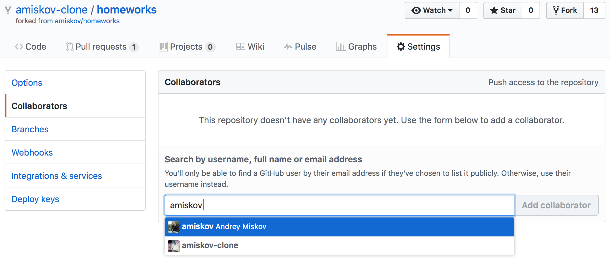

# Как вполнять задания
В примерах ниже пользователь `amiskov` выдает и проверят задачи, `amiskov-clone` их выполняет.

## Подготовка
### Форкните этот репозиторий
Нажмите кнопку , у вас в профиле появится своя собственная копия этого репозитория. Склонируйте ее на свой компьютер.

### Добавьте проверяющего в коллабораторы
Коллабораторы — это те, кто может вносить изменения в репозиторий. Добавив проверяющего в коллабораторы вы даете ему возможность вносить изменения в файлы вашего форка (оставлять комментарии, одобрять пул-реквесты):



Проверяющему придет письмо с инвайтом, он его подтвердит и все будет готово к работе.

## Порядок выполнения
В ветке `master` вашего форка должны быть _только условия задач_. Не меняйте мастер, иначе при изменениях в основном репозитории будут конфликты.

Рассмотрим пример.

Вам нужно сделать задачу из папки `/city-selector` (в ней лежит соответствующее описание и шаблон). Ваши действия:

1. Создайте ветку `homework_city-selector` из мастера.
2. Решите задачу в этой ветке и запуште изменения.
3. Отправьте проверяющему ссылку на эту ветку для проверки.

Проверяющий посмотрит решение и оставит комментарии.

## Обновление форка из основного репозитория
В основном репозитории файлы могут меняться: добавляться новые задания, редактироваться существующие. Периодически нужно будет подтягивать изменения в свой форк. Ниже приведена инструкция, как это сделать.

Проверьте, какие удаленные репозитории вам доступны. Если вы еще не делали обновлений, то вам будет доступен удаленный репозиторий `origin` с урлом вашего форка:

```sh
> git remote -v
origin  https://github.com/amiskov-clone/homeworks.git (fetch)
origin  https://github.com/amiskov-clone/homeworks.git (push)
```

Нужно добавить URL оригинального репозитория в remotes. Назовем оригинальный удаленный репозиторий `upstream`:

```sh
> git remote add upstream https://github.com/amiskov/homeworks.git
```

Теперь у вас есть 2 удаленных репозитория: для вашего форка — `origin` и основной — `upstream`:

```sh
> git remote -v
origin  https://github.com/amiskov-clone/homeworks.git (fetch)
origin  https://github.com/amiskov-clone/homeworks.git (push)
upstream    https://github.com/amiskov/homeworks.git (fetch)
upstream    https://github.com/amiskov/homeworks.git (push)
```

Подтяните изменения из основного репозитория командой `fetch`:

```sh
> git fetch upstream 
```

И добавьте их в свой `master`:

```sh
> git checkout master
> git merge upstream/master
```

Не забывайте пушить изменения в удаленный репозиторий своего форка после апдейта:

```sh
> git push origin master
```